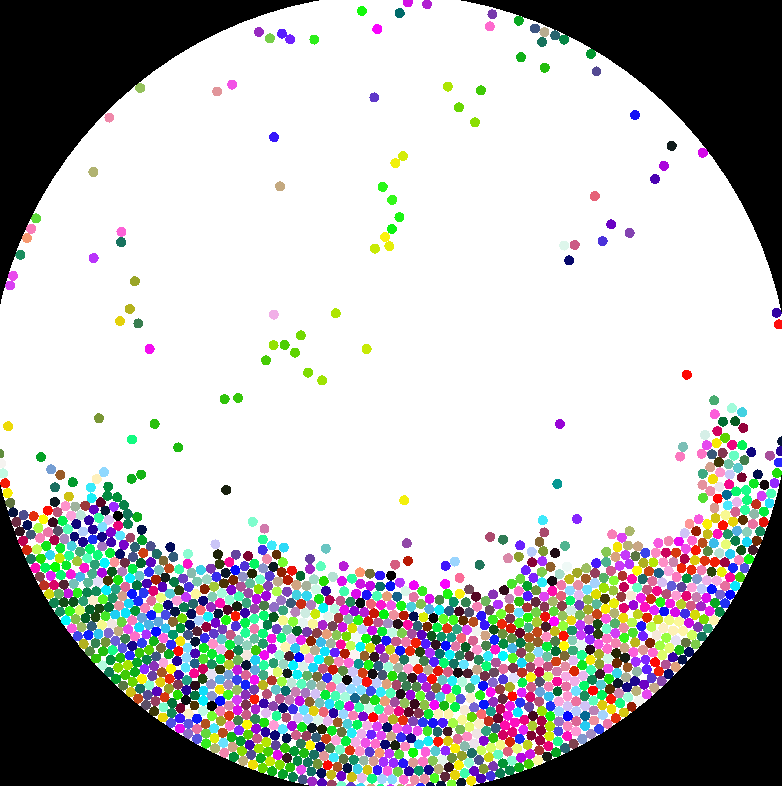

# Particle Simulation

A simple particle simulation written in C++ using [SFML 3.0](https://github.com/SFML/SFML). Particles interact with each other using a grid-based spatial partitioning system and constraints-based physics.

## Features

- Verlet integration for motion
- Rectangular boundary constraints
- Spatial hashing grid for optimized collision detection
- SFML rendering with dynamic particles
- Mouse interaction allowing for induced forces

